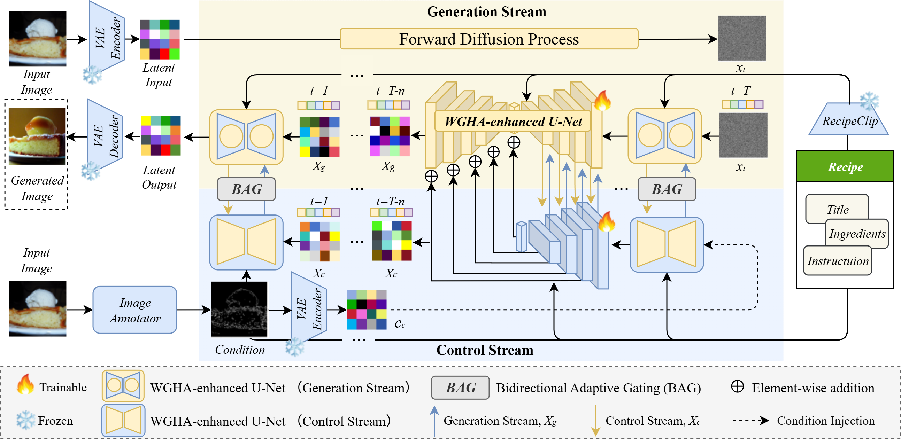
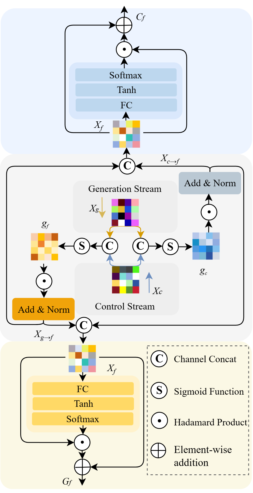
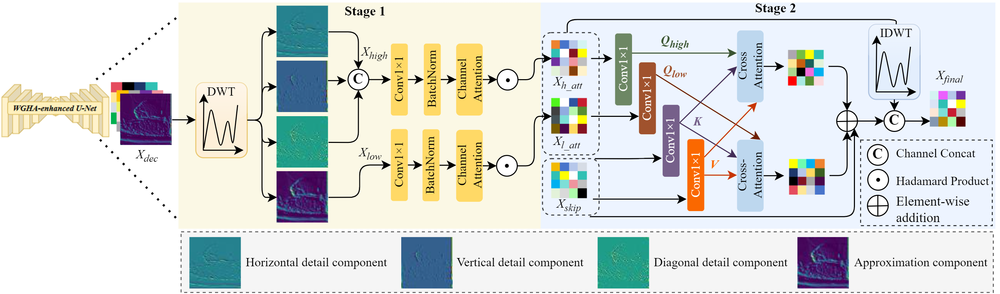

# CondFoodGen

**A Conditional Two‑Stream Network for Controllable Food Image Generation**

[](LICENSE)
[](https://www.python.org/downloads/)
[](https://pytorch.org/)

## 📝 Overview

**CondFoodGen** is a diffusion‑based framework for **controllable food image generation** from recipe texts and structural conditions. Its key innovations are:
1. **A two‑stream architecture** for decoupled control and generation.
2. **Bidirectional Adaptive Gating (BAG)** for dynamic cross‑stream interaction.
3. **Wavelet‑Guided Hierarchical Attention (WGHA)** for multi‑frequency feature refinement.

## 🏗️ Framework




**Bidirectional Adaptive Gating (BAG)** enables dynamic cross‑stream interaction.  
<p align="center">
  
</p>

**Wavelet‑Guided Hierarchical Attention (WGHA)** refines multi‑frequency features.  


## 📊 Quantitative Results

<div align="center">

###  🍽️ Comparison with food‑specific generation methods


###  🎮 Comparison with conditional generation methods


</div>

### 🍰 Ablation study of BAG and WGHA modules

<div align="center">
  
</div>

## 🚀 Getting Started

### Environment Setup

We recommend using a virtual environment (Python 3.8+).

#### PyTorch 1.13 (CUDA 11.7)
```bash
python3 -m venv .pt13
source .pt13/bin/activate          # Linux/macOS
# .pt13\Scripts\activate           # Windows
pip install -r requirements/pt13.txt

## 🧪 Training

We provide a single training script `main.py` with a three‑phase progressive strategy.

### Prerequisites

- Download and prepare the dataset (e.g., VIREO Food‑172, Recipe1M, Food2K).  
- Place the dataset root path in the config file `configs/training/sd/sd15_encD_canny_53m.yaml` (modify `data.params.train.root` and `data.params.validation.root`).
- (Optional) Download a pretrained Stable Diffusion 1.5 checkpoint and set its path in the config.

### Training Command

```bash
python main.py -t --base configs/sd15_encD_canny_53m.yaml --logdir ./logs --name your_experiment_name
